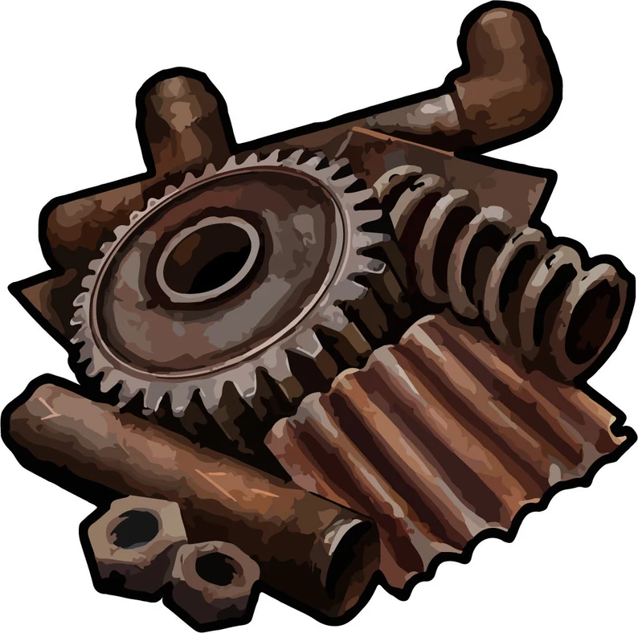

<!DOCTYPE html>
<html lang="en">
<head>
    <meta charset="UTF-8">
    <meta name="viewport" content="width=device-width, initial-scale=1.0">
    <title>Clicker</title>
    
</head>
<body>
    

        <h1>Rust clicker</h1>
        
Количество скрапа: 0

        
говорят что-бы изучить всё нужно 15к скрапа

        <!-- Добавлен элемент audio для воспроизведения звука -->
        <audio id="clickSound" src="click_sound.mp3"></audio>
        
        

            <button id="wipeButton" onclick="buyWipe()">Вайп: 10 Скрапа</button>
        

        
by flecksis

    

    
</body>
</html>
